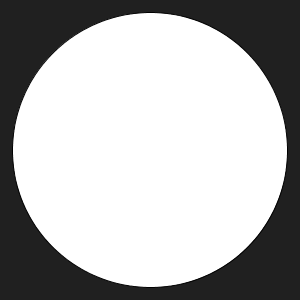
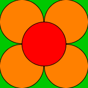
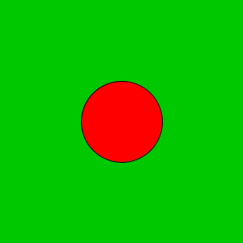
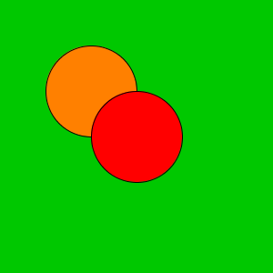
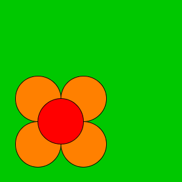

Now you know how to [use variables](using-variables) like `width` and `height`. Next you'll learn how to create your own variables!

Remember that variables are **names** that hold **values**. You can use a variable anywhere you can use a value, by writing its name. For example:

```java
size(300, 300);
background(32);
ellipse(width / 2, height / 2, width - 25, height - 25);
```

This sketch uses the `width` and `height` variables to draw a circle that fills up the window.



You aren't limited to using only what Processing gives you. You can also create your own variables!

# Types

Processing needs to know what kind, or **type**, of value that a variable will hold. There are a few different types to choose from:

- The `int` type holds whole numbers like `0`, `1`, or `-256`.
- The `float` type holds decimal numbers like `0.5`, `3.14`, or `-123.45`.
- The `String` type holds text like `"Hello world"`, `"Happy Coding"`, or `"Stanley"`. `String` values are always between quotation marks.

There are other types, but these three are good enough for now!

# Creating Variables

To create a variable, you give it a **type**, a **name**, and a **value**.

- The **type** tells Processing what kind of value the variable will hold.
- The **name** is how you'll use the variable later in the code, like you've used `width` and `height`.
- The **value** is what the variable points to.

You create a variable by giving it a type and a name, then assigning a value using the `=` operator.

```java
float circleX = 150;
float circleY = 200;
float circleDiameter = 100;
```

This code creates three `float` variables: `circleX` points to a value of `150`, `circleY` points to a value of `200`, and `circleDiameter` points to a value of `100`.

You can use the variables just like you would use any value, which means you can use them as arguments for the `ellipse` function: 

```java
size(300, 300);
background(32);

float circleX = 150;
float circleY = 200;
float circleDiameter = 100;

ellipse(circleX, circleY, circleDiameter, circleDiameter);
```


Try changing the variables to see the effect they have on the circle.

# Example

Remember the example from [the using variables tutorial](using-variables) that draws a flower based on the `width` and `height` variables:

```java
size(300, 300);

background(0, 200, 0);

fill(255, 128, 0);

// upper-left petal
ellipse(width/4, height/4, width/2, height/2);

// upper-right petal
ellipse(width*.75, height/4, width/2, height/2);

// lower-left petal
ellipse(width/4, height*.75, width/2, height/2);

//lower-right petal
ellipse(width*.75, height*.75, width/2, height/2);

fill(255, 0, 0);

// center petal
ellipse(width/2, height/2, width/2, height/2);
```

This code uses the `width` and `height` variables to draw a flower that fills up the window.



The `width` and `height` variables are handy if you want to tie your sketch to the window size, but if you want more control, you can use your own variables. Let's rewrite this example to use your own variables now!

Start by creating four variables that you'll use when drawing the flower:

```java
float flowerX = 150;
float flowerY = 150;
float petalSize = 100;
float petalDistance = petalSize / 2;
```

- `flowerX` holds the horizontal position of the center of the flower.
- `flowerY` holds the vertical position of the center of the flower.
- `petalSize` holds the diameter of the petals.
- `petalDistance` holds the space between the center of the flower and the four orange petals. Notice that this line uses the `petalSize` variable to calculate its value!

Unlike the `width` and `height` variables, the names of these variable are completely up to you. You can name them anything you want.

Now that you have your variables, use them to draw the center red petal first:

```
size(300, 300);

float flowerX = 150;
float flowerY = 150;
float petalSize = 100;
float petalDistance = petalSize / 2;

background(0, 200, 0);

// center petal
fill(255, 0, 0);
ellipse(flowerX, flowerY, petalSize, petalSize);
```

This code calls the `ellipse` function using your variables as parameters. You should see this:



This might not seem like much, but this gives you a good base to expand on. Working in small steps like this makes it easier to fix mistakes, because you can test your code as you write it!

Next, draw the upper-left orange petal:

```java
size(300, 300);

float flowerX = 150;
float flowerY = 150;
float petalSize = 100;
float petalDistance = petalSize / 2;

background(0, 200, 0);

fill(255, 128, 0);

// upper-left petal
ellipse(flowerX - petalDistance, flowerY - petalDistance, petalSize, petalSize);

// center petal
fill(255, 0, 0);
ellipse(flowerX, flowerY, petalSize, petalSize);
```

If this new line is confusing, that's okay! Think about each argument being passed into the `ellipse` function.

- Remember that `flowerX` is the horizontal center of the red petal, so `flowerX - petalDistance` is to the left of the red petal.
- Similarly, `flowerY` is the vertical center of the red petal, so `flowerY - petalDistance` is above the red petal.

The result is another circle in the upper-left corner of the red petal:



Next, draw the upper-right petal:

```java
// upper-right petal
ellipse(flowerX + petalDistance, flowerY - petalDistance, petalSize, petalSize);
```

This is very similar to the line of code you just added, but it uses `flowerX + petalDistance` to calculate a position that's to the right of the red petal.


Finally, add the two bottom petals.

**Try to figure this out on your own before continuing!**

Putting it all together, the code looks like this:

```java
size(300, 300);

float flowerX = 150;
float flowerY = 150;
float petalSize = 100;
float petalDistance = petalSize / 2;

background(0, 200, 0);

fill(255, 128, 0);

// upper-left petal
ellipse(flowerX - petalDistance, flowerY - petalDistance, petalSize, petalSize);

// upper-right petal
ellipse(flowerX + petalDistance, flowerY - petalDistance, petalSize, petalSize);

// lower-left petal
ellipse(flowerX - petalDistance, flowerY + petalDistance, petalSize, petalSize);

// lower-right petal
ellipse(flowerX + petalDistance, flowerY + petalDistance, petalSize, petalSize);

// center petal
fill(255, 0, 0);
ellipse(flowerX, flowerY, petalSize, petalSize);
```


# Changing Variables

If you want to change the size and location of the flower, now all you have to do is change the values of the variables!

```java
float flowerX = 100;
float flowerY = 200;
float petalSize = 75;
```

The rest of the code stays the same, but now the flower is smaller and in a different location.



Think about how you would do this without variables. Every time you wanted to change the size of your flower, you would have to change the code on a bunch of different lines! But because you're using variables, you only have to change it in one place.

You could also combine what you've seen so far, and move the flower to the center of the window:

```java
float flowerX = width / 2;
float flowerY = height / 2;
```


Remember: you can use a variable anywhere you can use a value, including when creating another variable!

# Random

Now that you know how to create variables, I can introduce you to one of my favorite functions: the `random` function!

The `random` function gives you a random value between two parameters. You can read more about it in [the reference](https://processing.org/reference/random_.html).

This might not sound very useful, but it allows you to add some variety to your programs instead of the same thing happening every time you run your code. You might use the `random` function to draw a flower at a random location:

```java
float flowerX = random(0, width);
float flowerY = random(0, height);
```

Now the `flowerX` variable will hold a random value between `0` and `width`, and `flowerY` will hold a random value between `0` and `height`. This means the flower will appear in a different location every time you run the program. You could also give the flower a random size, or even random colors!

```java
size(300, 300);

float flowerX = random(0, width);
float flowerY = random(0, height);
float petalSize = random(25, 150);
float petalDistance = petalSize / 2;

background(0, 200, 0);

fill(255, 128, 0);

// upper-left petal
ellipse(flowerX - petalDistance, flowerY - petalDistance, petalSize, petalSize);

// upper-right petal
ellipse(flowerX + petalDistance, flowerY - petalDistance, petalSize, petalSize);

// lower-left petal
ellipse(flowerX - petalDistance, flowerY + petalDistance, petalSize, petalSize);

// lower-right petal
ellipse(flowerX + petalDistance, flowerY + petalDistance, petalSize, petalSize);

fill(255, 0, 0);

// center petal
ellipse(flowerX, flowerY, petalSize, petalSize);
```

Variables allow you to "remember" a value so you can reuse it in multiple places. Without variables, using random values would be very difficult!

# Your Turn

- Remember your drawing from the previous tutorial? Instead of basing it off the `width` and `height` variables, change it to draw at a location and size that you store in your own variables. Test that your code works with different values for each variable.
- Make a program that randomizes your drawing. Draw it at a random location, with random sizes and random colors. This is called [procedural generation](https://en.wikipedia.org/wiki/Procedural_generation)!
- Challenge: Make a program that shows the current time. Hint: check the reference for useful functions! Get creative: make the clock change color throughout the day, or show the time in dog years.
- Challenge: Make a program that uses variables to calculate something useful for you: how long will you be paying student loans? What percentage of your income goes to rent? What grade do you need to get on your final to get an A in the class?

# Credits

Thanks to Kevin Workman of [Happy Coding](https://happycoding.io/tutorials/processing/creating-variables) for the original source material for this note.