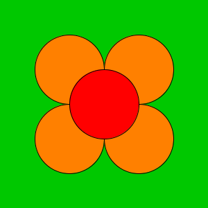
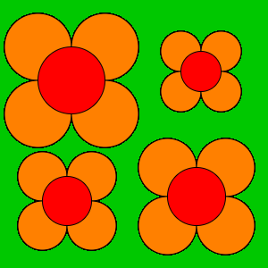
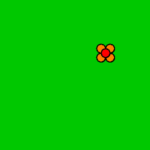

Now you now know how to [call functions](/tutorials/processing/calling-functions), [use variables](/tutorials/processing/using-variables), and [create your own variables](/tutorials/processing/creating-variables).

This tutorial shows you how to create your own functions.   You can find a video explanation of this note [here](https://drive.google.com/file/d/19LT_XiVXGFxeG1v8YxnpW8R6w_4euuKl/view?usp=sharing).

Creating your own functions allows you to organize your code into smaller chunks and treat complicated tasks as a single step.

Creating functions also allows you to do more advanced things like animations and getting user input.

# Defining Functions

To create your own function, you need to do four things:

- Write the **return type** of the function.
- Write the **name** of the function.
- Inside parenthesis `()`, list any parameters the function takes.
- Inside curly brackets `{}`, write the code that will run whenever the function is called. This is called the **body** of the function.

## Return Types

Remember that functions can either **do something** (like draw an ellipse or change the fill color) or **give you a value** (like a random number or the current time).

For example, the `random` function gives you a `float` value, which you can store in a variable. That means that the **return type** of the `random` function is `float`.

Compare that to the `ellipse` function, which draws a circle. The `ellipse` function doesn't give you any value, so it wouldn't make sense to try to store it in a variable. Since the `ellipse` function doesn't return anything, its return type is `void`.

Return types are important to keep in mind as you write your own functions. Most of the functions you're about to write will **do something** instead of giving you a value, so you'll see a lot of `void` return types.

# Example

Here's a function that draws a red circle:

```java
void drawRedCircle(float circleX, float circleY, float circleDiameter) {
  fill(255, 0, 0);
  ellipse(circleX, circleY, circleDiameter, circleDiameter);
}
```

This function has a `void` return type (which means it does something instead of giving you a value), and takes three parameters: `circleX`, `circleY`, and `circleDiameter`. The **body** of the function changes the fill color to red and then uses the parameters to draw a circle.

To call this function, you'd use its name and give it parameters, exactly like you've been calling other functions:

```java
drawRedCircle(100, 200, 50);
```

This allows you to treat a task that takes multiple steps (like changing the fill color to red and drawing a circle) as a single step. This will become very useful as your code gets more complicated!

## The `setup()` and `draw()` Functions

Let's start out with code that doesn't use any custom functions. By now you're probably pretty familiar with this code:

```java
size(300, 300);

background(0, 200, 0);

float flowerX = 150;
float flowerY = 150;
float petalSize = 100;
float petalDistance = petalSize / 2;

fill(255, 128, 0);

// upper-left petal
ellipse(flowerX - petalDistance, flowerY - petalDistance, petalSize, petalSize);

// upper-right petal
ellipse(flowerX + petalDistance, flowerY - petalDistance, petalSize, petalSize);

// lower-left petal
ellipse(flowerX - petalDistance, flowerY + petalDistance, petalSize, petalSize);

// lower-right petal
ellipse(flowerX + petalDistance, flowerY + petalDistance, petalSize, petalSize);

// center petal
fill(255, 0, 0);
ellipse(flowerX, flowerY, petalSize, petalSize);
```

This code creates a `300x300` window, draws a green background, and then draws a flower in the middle of the window:



You can modify this program to use your own functions instead. For example, you might split up the setup and drawing code into two functions:

```java
void setup() {
  size(300, 300);
  background(0, 200, 0);
}

void draw() {
  float flowerX = 150;
  float flowerY = 150;
  float petalSize = 100;
  float petalDistance = petalSize / 2;

  fill(255, 128, 0);

  // upper-left petal
  ellipse(flowerX - petalDistance, flowerY - petalDistance, petalSize, petalSize);

  // upper-right petal
  ellipse(flowerX + petalDistance, flowerY - petalDistance, petalSize, petalSize);

  // lower-left petal
  ellipse(flowerX - petalDistance, flowerY + petalDistance, petalSize, petalSize);

  // lower-right petal
  ellipse(flowerX + petalDistance, flowerY + petalDistance, petalSize, petalSize);

  // center petal
  fill(255, 0, 0);
  ellipse(flowerX, flowerY, petalSize, petalSize);
}
```

Both of these functions have a `void` return type, which means that they **do something** instead of returning a value. The `setup` function handles telling Processing how big the window should be and setting the background color, and the `draw` function draws the flower.

I didn't pick the names of these functions randomly. Processing **automatically** calls the `setup` and `draw` functions! You'll learn more about that in the [animation](#animation) section below.

# Custom Functions

Now you know how to write functions like `setup` and `draw` that Processing automatically calls. This helps organize your code, but what if you want to draw lots of different things? You could add all of your code to the `draw` function, but that would get pretty messy.

Imagine modifying the flower program to draw four different flowers, each with its own location and size. You would probably copy-paste a lot of the same code, which would make it hard to change. What if you wanted to change your flowers to all have blue centers? You'd have to make the same change in four different places!

**Challenge:** If you don't believe that would be annoying, try it! Write a program that draws four flowers, and then change the code so all of the flowers have blue center petals!

To help with this, you could move all of the code related to drawing a flower into a `drawFlower` function.

To create a function, you write its return type (often `void`), then its name, then its parameters inside `()` parentheses, and finally, inside `{ }` curly brackets, write the code that should run when you call that function.

```java
void drawFlower(float flowerX, float flowerY, float petalSize) {
  float petalDistance = petalSize / 2;

  fill(255, 128, 0);

  // upper-left petal
  ellipse(flowerX - petalDistance, flowerY - petalDistance, petalSize, petalSize);

  // upper-right petal
  ellipse(flowerX + petalDistance, flowerY - petalDistance, petalSize, petalSize);

  // lower-left petal
  ellipse(flowerX - petalDistance, flowerY + petalDistance, petalSize, petalSize);

  // lower-right petal
  ellipse(flowerX + petalDistance, flowerY + petalDistance, petalSize, petalSize);

  // center petal
  fill(255, 0, 0);
  ellipse(flowerX, flowerY, petalSize, petalSize);
}
```

Unlike the `setup` and `draw` functions, Processing will **not** call the `drawFlower` function automatically. But you can now call it yourself, exactly like you've been calling other functions!

```java
void setup() {
  size(300, 300);
  background(0, 200, 0);
}

void draw() {
  drawFlower(150, 150, 100);
}

void drawFlower(float flowerX, float flowerY, float petalSize) {
  float petalDistance = petalSize / 2;

  fill(255, 128, 0);

  // upper-left petal
  ellipse(flowerX - petalDistance, flowerY - petalDistance, petalSize, petalSize);

  // upper-right petal
  ellipse(flowerX + petalDistance, flowerY - petalDistance, petalSize, petalSize);

  // lower-left petal
  ellipse(flowerX - petalDistance, flowerY + petalDistance, petalSize, petalSize);

  // lower-right petal
  ellipse(flowerX + petalDistance, flowerY + petalDistance, petalSize, petalSize);

  // center petal
  fill(255, 0, 0);
  ellipse(flowerX, flowerY, petalSize, petalSize);
}
```

This code calls the `drawFlower` function with parameters `150, 150, 100` which draws a flower with an X coordinate of `150`, a Y coordinate of `150`, and a petal size of `100`. Try changing the parameters to see what happens!

Now that you have a `drawFlower` function, you can call it as many times as you want, with whatever parameters you want!

```java
void draw() {
  drawFlower(80, 90, 75);
  drawFlower(225, 80, 45);
  drawFlower(75, 225, 55);
  drawFlower(220, 220, 65);
}
```



The payoff here is that you can treat the `drawFlower` function as a single step, even though it's really doing a bunch of stuff when you call it. You don't have to worry about *how* the flower is drawn, exactly like you didn't have to worry about *how* the `ellipse` function works behind the scenes.

And now if you want to make a change to how your flowers are drawn, you only have to change it in one place instead of changing each individual flower. Try changing the center petal color to blue!

# Animation

Remember that Processing automatically calls the `setup` and `draw` functions. There's something very powerful going on behind the scenes: Processing automatically calls the `setup` function **once** at the beginning of the program, and then calls the `draw` function **60 times per second**.

The `setup` function is useful for things you only want to happen once: sizing the window, loading images, reading from files, that kind of thing.

The fact that the `draw` function is called 60 times per second allows you to make your programs animated and interactive. So far, the code draws the same flower(s) every time the `draw` function is called.

But what happens if you use the `random` function to draw a random flower every time `draw` is called?

```java
void draw() {
  drawFlower(random(width), random(height), random(10, 25));
}
```

Now the code draws a new random flower every time the `draw` function runs (60 times per second), which means random flowers fill up the window.



You'll learn more about this in the [Processing animation tutorial](/tutorials/processing/animation), but for now it's enough to know that creating your own custom functions makes it easier to organize your code into logical pieces that you can treat as a single step.

## Summary

Remember that a program is a lot like a recipe: a recipe is a list of steps that you follow in order, and a program is a list of function calls that the computer follows in order.

Calling a custom function is like referencing an icing recipe from a cake recipe.

```
...
Pour the cake batter into a cake pan.
Bake for 45 minutes.
While you wait, follow the icing recipe on page 42.
Remove the cake from the oven, and spread the icing on top.
```

The author of the cake recipe doesn't even need to know anything about the icing recipe! All they care about is the end result. They might also refer to a recipe multiple times: for example the recipe for a three-layer cake might refer to a recipe for making a single cake three times. This makes it easier to focus on one recipe at a time, and to organize the steps into a more logical structure.

The same thing is true of creating functions. Creating functions allows you to organize your code, and to *encapsulate* your complicated logic (like drawing a flower) into a function call that you can treat as a single step.

Creating functions also allow you to repeat work without repeating code: to draw four flowers, you called the `drawFlower` function four times with different parameters.

You can also use the `setup` and `draw` functions to make programs that are interactive and animated, which you'll learn about in the next few tutorials.

## Homework

- Try to turn the drawing you made for the previous lesson into a function.
- Create a `drawHouse` function that draws a house. Take in parameters for the house location, size, color, etc.
- Create a `drawBlock` function that draws 4 houses. Take in parameters for the block location, size, color, etc. Don't write code that draws 4 houses! Instead, call the `drawHouse` function 4 different times with different parameters.
- Create a `drawNeighborhood` function that draws 9 blocks. Take in parameters for the neighborhood location, size, color, etc. Call the `drawBlock` function to draw the blocks.
- Create a `drawCity` function that fills the window with neighborhoods.


# Credits

Thanks to Kevin Workman of [Happy Coding](https://happycoding.io/tutorials/processing/creating-functions) for the original source material for this note.

