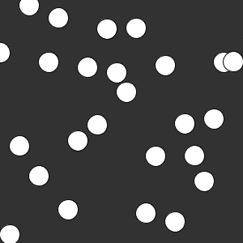

# Arrays

## Video Note
Now you know how to [create variables](tbc) and [functions](tbc), and you know how to use [`for` loops](tbc) to repeat a block of code.

So far, the variables you've seen have held a single value. This tutorial introduces **arrays**, which hold multiple values.  See the following video notes:

Version 2: https://drive.google.com/file/d/1p-CIl_7rMGb1BKP0Sw9RzSwgHfL5Yb0g/view?usp=sharing

Version 1: https://drive.google.com/file/d/1l4OdMyFkrcQ3TBiptXUWVQAwxts0hkQW/view?usp=sharing

# Multiple Variables

Let's start with an example sketch:

```java
float circleY = 0;

void setup() {
  size(300, 300);
}

void draw() {
  background(50);

  ellipse(150, circleY, 25, 25);

  circleY++;

  if (circleY > height) {
    circleY = 0;
  }
}
```

This sketch uses a `circleY` variable to show a circle falling down the screen. Incrementing the `circleY` each frame causes it to fall. The `if` statement detects when the circle reaches the bottom, and resets the circle back to the top of the screen.


# The Bad Way

What if you want to add another circle? You might be tempted to use another variable:

```java
float circleYOne = 0;
float circleYTwo = 0;

void setup() {
  size(300, 300);
}

void draw() {
  background(50);

  ellipse(100, circleYOne, 25, 25);
  ellipse(200, circleYTwo, 25, 25);

  circleYOne++;
  circleYTwo += 2;

  if (circleYOne > height) {
    circleYOne = 0;
  }

  if(circleYTwo > height){
   circleYTwo = 0;
  }
}
```

This code uses two variables: `circleYOne` and `circleYTwo` to show two circles that fall from the top of the screen.


# Creating an Array

What if you wanted to add a third circle? Or ten more circles? You could keep adding variables, but that's going to make your program very long and hard to work with. Instead, you can use an **array**.

An array is a single variable that holds multiple values. Remember that to create a variable you need to give it a type, a name, and a value. To create an array, you need to do three things:

- Give it an **array type**. An array type is a normal type with square brackets `[]` after it, meaning that the variable will hold multiple values of that type.
- Give it a name.
- Give it an **array value**. An array value is multiple values inside curly brackets `{}` and separated by commas.

For example, this line of code creates a `float[]` array named `circleY` that holds two values, `10` and `20`:

```java
float[] circleY = {10, 20};
```

# Accessing an Array

An array is a variable that holds multiple values. To use an individual value inside an array, you can use the **array access** operator. The array access operator is an `int` value inside square brackets `[]`. The `int` value provides the **index** of the array value that you want to use. For example, this line of code accesses the first and second values from the array to draw two circles:

```java
ellipse(100, circleY[0], 25, 25);
ellipse(200, circleY[1], 25, 25);
```

This line of code does the same thing as before, but now it's getting the values from an array instead of two separate variables.

# Start at Zero

You might notice that the code uses `0` instead of `1` to get the first value from the array. That's because array indexes start at zero!

The **second** value from the array has `1` as an index:

```java
// draw the second circle
ellipse(200, circleY[1], 25, 25);
```

This can be pretty confusing, but remember that array indexes start at zero. So if you have an array with ten values, the last index is `9`.

# Setting an Array Index

Just like you can modify the value a variable holds, you can modify the value an array index holds.

This line of code reassigns the first index of the array to a new value:

```java
circleY[0] = 42;
```

And this line of code adds 5 to the first array index:

```java
circleY[0] = circleY[0] + 5;
```

Which can be shortened to:

```java
circleY[0] += 5;
```

# The Bad Way with Arrays

Putting it all together, you could rewrite the sketch to use arrays instead of single-value variables:

```java
float[] circleY = {0, 0};

void setup() {
  size(300, 300);
}

void draw() {
  background(50);

  ellipse(100, circleY[0], 25, 25);
  ellipse(200, circleY[1], 25, 25);

  circleY[0]++;
  circleY[1] += 2;

  if (circleY[0] > height) {
    circleY[0] = 0;
  }

  if (circleY[1] > height) {
    circleY[1] = 0;
  }
}
```

I'm using this example to show how arrays work, but you wouldn't actually write code like this. If you added a third value to the `circleY` array, you'd still need to add the code that uses that new value. That's going to get very annoying! Instead of copying the same line of code over and over again, you can use `for` loops to make your life easier.

# For Loops

Let's say the `circleY` array holds five values. You can write code that draws five circles:

```java
ellipse(50, circleY[0], 25, 25);
ellipse(100, circleY[1], 25, 25);
ellipse(150, circleY[2], 25, 25);
ellipse(200, circleY[3], 25, 25);
ellipse(250, circleY[4], 25, 25);
```

(I'm leaving out the code for moving and resetting the circles, but imagine how long that code would be!)

This will work, but notice that this code contains a **pattern**: it uses an index that starts at `0`, increases by `1`, and stops at `4`.

That means you can rewrite this code to use a `for` loop instead!

```java
for (int i = 0; i < 5; i++) {
  ellipse(50 * (i+1), circleY[i], 25, 25);
}
```

This code uses a `for` loop with a loop variable `i` that goes from `0` to `4`. When the `i` variable reaches `5`, then `i < 5` evaluates to `false` and the loop exits.

Inside the body of the loop, the code uses that loop variable to access every index of the array. It also uses that loop variable to calculate the `x` value of each circle.

You can rewrite the code to use a `for` loop:

```java
float[] circleY = {50, 100, 150, 200, 250};

void setup() {
  size(300, 300);
}

void draw() {
  background(50);

  for (int i = 0; i < 5; i++) {
    float circleX = 50 * (i + 1);
    ellipse(circleX, circleY[i], 25, 25);

    circleY[i]++;

    if (circleY[i] > height) {
      circleY[i] = 0;
    }
  }
}
```


And that's the cool thing about arrays, especially when you use `for` loops with them: you now have 5 falling circles, without any extra code! You only have to write the code that draws, moves, and resets a circle once, and then you can apply that code to every circle in the array.

# Array Length

When you're using a `for` loop with an array, you have to know how many values are in the array, so you know which index to stop at.

When there are **two** values, the `for` loop looks like this:

```java
for (int i = 0; i < 2; i++) {
```

And when there are **ten** values, the `for` loop looks like this:

```java
for (int i = 0; i < 10; i++) {
```

In other words, you always want to stop the loop when its loop variable equals the number of elements in the array, which is also called the **length** of the array. If you try to access an index that's larger than the length, you'll get an error!

So if you add a variable to the array initialization (the values in the curly brackets `{}`), you'll have to change the check in the `for` loop. Wouldn't it be nice if the computer could keep track of that for you?

You guessed it: the computer does keep track of the length of an array! To use the length value, you type `.length` after the name of an array:

```java
int numberOfValues = circleY.length;
```

You can use this length variable exactly like you can any other variable, including in a `for` loop check:

```java
for (int i = 0; i < circleY.length; i++) {
```

Now if you add values to the array, you no longer have to modify the `for` loop check yourself. The `length` variable will always contain the length of the array, so the `for` loop will work no matter how many elements the array contains.

# Delayed Initialization

Remember that **declaring** a variable means giving it a type and a name, and **initializing** a variable means giving it a starting value. **Reassigning** a variable means changing its value.

So far, the code above has initialized arrays as soon as it declares them, using values inside curly brackets `{}`:

```java
float[] circleY = {50, 100, 150, 200, 250};
```

But what if you don't know what the values should be yet? In this case, you can delay the initialization of the array.

To create an array without initializing its values, you use the `new` keyword, followed by the array type, and then you give the array a size inside square brackets `[]`.

This line of code creates an array with five empty indexes:

```java
float[] circleY = new float[5];
```

Now you can set the value of each of the indexes individually:

```java
  circleY[0] = 50;
  circleY[1] = 100;
  circleY[2] = 150;
  circleY[3] = 200;
  circleY[4] = 250;
```

Or better yet, you can use a `for` loop:

```java
for (int i = 0; i < circleY.length; i++) {
  circleY[i] = (i + 1) * 50;
}
```

# The Payoff

Putting all of this together, here's an example that shows 25 falling circles:

```java
float[] circleY = new float[25];

void setup() {
  size(300, 300);
  for (int i = 0; i < circleY.length; i++) {
    circleY[i] = random(height);
  }
}

void draw() {
  background(50);

  for (int i = 0; i < circleY.length; i++) {
    float circleX = width * i / circleY.length;
    ellipse(circleX, circleY[i], 25, 25);

    circleY[i]++;

    if (circleY[i] > height) {
      circleY[i] = 0;
    }
  }
}
```



Imagine how much code this would take if it wasn't using arrays and `for` loops!

**Challenge:** Change this code to show 100 falling circles, all falling at different speeds!

# Summary

Arrays are variables that hold multiple values. By combining them with `for` loops, you can write programs that handle a lot of data in just a few lines of code.

# Homework

- Create a sketch that shows rain drops or snow flakes falling.
- Create a sketch that shows a trail of circles that follow the mouse. Hint:. store the previous 25 positions of the mouse in an array and draw those to the screen!

# Credits
Thanks to Kevin Workman of [Happy Coding](https://happycoding.io/tutorials/processing/arrays) for the original source material for this note.
