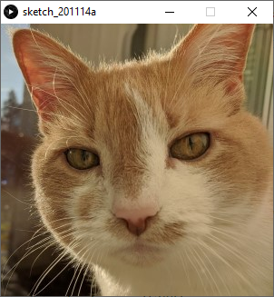
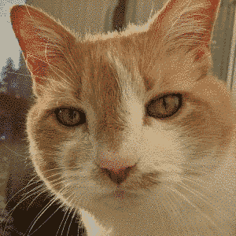
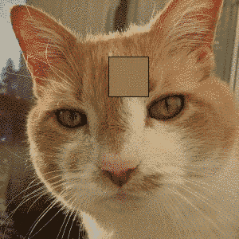

# Images

Now you know how to [use objects](/tutorials/processing/using-objects) and [create your own classes](/tutorials/processing/creating-classes). You know how to create an **instance** of a class, store it in a variable, and then call functions belonging to that instance.

For example, you've seen the predefined `PVector` class:

```java
PVector circle = new PVector(100, 100);
circle.add(25, 50); // circle is now 125, 150
ellipse(circle.x, circle.y, 25, 25);
```

Processing offers several other predefined classes. One of them is the `PImage` class, which lets you load, display, and manipulate image files.

# Adding Files to Your Sketch

Before you can use an image file in your code, you have to add it to your sketch. From your Processing editor, go to `Sketch > Add File`, and then choose the image file you want to add. That will copy the file into your sketch's `data` directory (which you can view by going to `Sketch > Show Sketch Folder`).

You can also drag the file onto the Processing editor, and it'll do the same thing.

# Loading Images

After you've added an image file to your sketch, you can call the `loadImage()` function to create an instance of the `PImage` class.

For example, if you have an image file named `stanley.jpg`, you can create an instance of `PImage` like this:

```java
PImage stanleyImage = loadImage("stanley.jpg");
```

You can also reference an image on the internet using its URL:

```java
PImage stanleyImage = loadImage("https://happycoding.io/images/stanley-1.jpg");
```

# Drawing Images

Now that you have an instance of `PImage` stored in a variable, you can display it by calling the `image()` function.

The `image()` function takes three parameters: an instance of `PImage` and `x` and `y` coordinates that tell Processing where to draw the image.

```java
PImage img;

void setup() {
  size(300, 300);
  img = loadImage("https://happycoding.io/images/stanley-1.jpg");
}

void draw() {
  image(img, 0, 0);
}
```




The `image()` function is just like the other drawing functions you've already seen, like the `rect()` and `ellipse()` functions. Try experimenting with different x and y parameters!

```java
PImage img;

void setup() {
  size(300, 300);
  img = loadImage("https://happycoding.io/images/stanley-1.jpg");
}

void draw() {
  image(img, mouseX, mouseY);
}

```


Note that these sketches **declare** the `img` variable at the top of the sketch, then **initialize** it inside the `setup()` function, and then display it in the `draw()` function. You should follow this pattern with your images as well. If you load your image in the `draw()` function, you'd be reading the same file 60 times every second, which could slow your program down or even cause it to crash.

**Remember:** declare your images at the top of the sketch, load them in `setup()`, and display them in `draw()`.

# Resizing Images

The `PImage` class contains several useful functions that let you manipulate images. For example, the `resize()` function resizes an image. Here's an example that resizes the image whenever the user clicks the mouse:

```java
PImage img;

void setup() {
  size(300, 300);
  img = loadImage("https://happycoding.io/images/stanley-1.jpg");
}

void mousePressed() {
  img.resize(mouseX, mouseY);
}

void draw() {
  image(img, 0, 0);
}
```



This is useful if you're loading a large image and want to display it smaller.

Note that this only changes the size of the instance, not the file itself.

# The color Type

The next few sections use a type you might not have seen before: the `color` type!

The `color` type is similar to other types like `float` and `int`, but `color` represents an R, G, B color. You can create a `color` using the `color()` function. Then when you have a `color` value, you can pass it into any function that also takes R, G, B arguments.

```java
size(300, 300);

color magenta = color(255, 0, 255);
background(magenta);

color cyan = color(0, 255, 255);
fill(cyan);
rect(100, 100, 100, 100);
```


To convert from a `color` to individual R, G, and B, values, you can use the `red()`, `green()`, and `blue()` functions which take a `color` argument and return the corresponding R, G, or B value.

I personally avoid the `color` type because I prefer working with separate R, G, and B values. But the next few functions *only* work with the `color` type!

# Getting Pixels

After you load an image, you can get the color of an individual pixel by calling the `get()` function.

Here's an example:

```java
PImage img;

void setup() {
  size(300, 300);
  img = loadImage("https://happycoding.io/images/stanley-1.jpg");
}

void draw() {
  image(img, 0, 0);

  // Get the color at the mouse position
  color c = img.get(mouseX, mouseY);

  // Change the fill to that color
  fill(c);

  // Draw a rectangle with that color
  rect(mouseX, mouseY, 50, 50);
}

```



This program uses the `get()` function to get the color of the pixel that's under the cursor's position, then displays a box showing that color. Think of it like a magnifying glass that shows you the pixel under the mouse.

# Setting Pixels

Just like you can get the color of a specific pixel using the `get()` function, you can also set the color of a specific pixel using the `set()` function. Here's an example that turns a random pixel black every frame:

```java
PImage img;

void setup() {
  size(300, 300);
  img = loadImage("https://happycoding.io/images/stanley-1.jpg");
}

void draw() {

  // Get a random position in the image
  int x = int(random(img.width));
  int y = int(random(img.height));

  // Set that pixel to black
  color black = color(0);
  img.set(x, y, black);

  image(img, 0, 0);
}
```


# Manipulating Images

You can create effects like image filters by looping over the pixels in the image, calling the `get()` function to get the color of each pixel, doing some logic with that color, and then calling the `set()` function to change the color of each pixel.

Here's an example that inverses the color of the image:

```java
PImage img;

void setup() {
  size(300, 300);
  img = loadImage("https://happycoding.io/images/stanley-1.jpg");

  // Loop over every pixel in the image
  for (int y = 0; y < img.height; y++) {
    for (int x = 0; x < img.width; x++) {
      // Read the pixel's color
      color in = img.get(x, y);

      // Inverse the color
      color out = color(255-red(in), 255-green(in), 255-blue(in));

      // Set the pixel's color
      img.set(x, y, out);
    }
  }
}

void draw() {
  image(img, 0, 0);
}
```


This code might seem complicated, but try to read through it one line at a time.

This line loops over every row in the image:

```java
for(int y = 0; y < img.height; y++) {
```

For each row, this line loops over each column in that row:

```java
for(int x = 0; x < img.width; x++) {
```

Given a row and a column (in other words, a `y` and an `x`), this line gets the color of that pixel:

```java
color in = img.get(x, y);
```

Now that you have the pixel's color, you can inverse that color by subtracting the R, G, and B components from 255:

```java
color out = color(255-red(in), 255-green(in), 255-blue(in));
```

If this part is confusing, try writing down some example colors and doing this math to see how it creates the inverse!

Finally, this line sets the color of the pixel to the newly calculated color:

```java
img.set(x, y, out);
```

Try modifying the logic to swap the blue and green of each pixel, or to divide the red by two, or to rearrange the pixels.


# Other Image Functions

The `PImage` class contains several other useful functions. Check out [the reference](https://processing.org/reference/PImage.html) for more info about them. Don't be afraid to experiment!

# Homework

- Take a colored image and display it as black and white.
- Take a black and white image and display it in color. Don't worry too much about getting the colors correct!
- Show a character that walks around when you press the arrow keys. Use different images for the different poses.
- Take an image and apply a custom filter to it.
- Resize an image to display in the `width` and `height` of the window while maintaining its aspect ratio. Tall image should show a border on the left and right. Wide images should show a border on the top and bottom.

# Credits
Thanks to Kevin Workman of [Happy Coding](https://happycoding.io/tutorials/processing/) for the original source material for this note.
