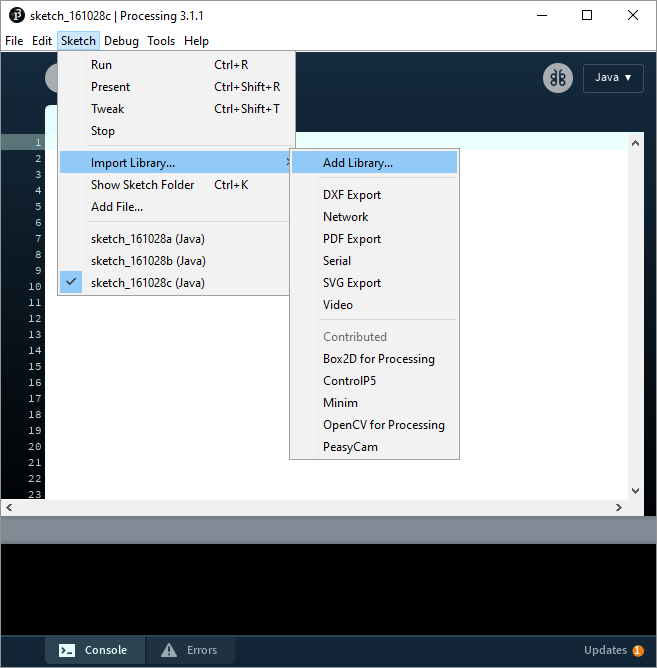
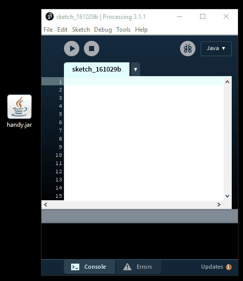
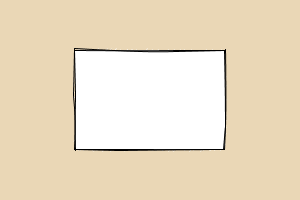
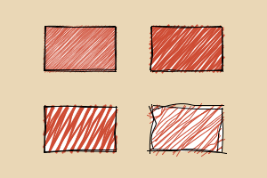

# Libraries

Now you know the fundamentals of coding in Processing. You know how to write code, and you know how to [use objects](/tutorials/processing/using-objects) and [create your own classes](/tutorials/procesing/creating-classes).

For example, you know how to use the `PVector` class to store a point, and you know how to use the `PImage` class to draw an image. You know how to call functions on these objects (like the `PVector.add()` and `PImage.resize()` functions) to run code that's inside these classes.

Now that you know all of that, you can use software libraries to expand what Processing can do.

# What's a library?

A library is a bunch of code that other people have already written, which you can add to your own sketch to expand Processing's functionality.

Libraries give you access to new classes that contain functions that let you run the library's code without really worrying about exactly how it all works.

To use a library, you have to add it to your sketch. There are a few ways to do that:

# Library Contributions Manager

The easiest way to find a library and add it to your sketch is using the Contribution Manager that comes with the Processing editor. From the Processing editor, go to the `Sketch` menu, then `Import Library...`, then `Add Library...`:



This brings up the Contribution Manager:


This shows you a list of libraries that are specifically designed to be used in Processing. Find the library you want, then click the `Install` button in the lower-right corner. After a minute or so, a green check mark will show up next to the library, and you can close the Contribution Manager.

**You aren't done yet!** That step downloads the library onto your computer, but you still have to add it to your sketch. Go back to the `Sketch` menu, then `Import Library...`, and then click the name of the library, which should be in that menu now.

Usually you'll see some `import` statements added to the top of your sketch. This means you're ready to use the library!

# Adding a Library Jar

The Contribution Manager lists a **few** of the libraries that can be used in Processing, but there are many others out there. In fact, since Processing is built using Java, **you can use any Java library in Processing!**

Usually these libraries are packaged as a `.jar` file, which you first have to download onto your computer.

When you have the `.jar` file, you can add it to your sketch **by dragging the file onto your Processing editor.**

For example, I'm going to download the [Handy](http://www.gicentre.net/handy/) library, which draws shapes in a hand-drawn style. Downloading the Handy library gives me a file named `handy.jar`, which I save to my desktop.

Now that I have the `.jar` file, I can add it to my sketch by dragging the file onto my Processing editor.



# Import Statements

The Contributions Manager handles adding import statements for you, but if you add a library jar manually, you have to add the import statements manually.

If you aren't familiar with import statements, here's a brief introduction:

Libraries organize their classes into **packages**, which is like a directory that holds classes. To use a library class, you have to do two things: first you have to add the library to your sketch (which you do via the Contributions Manager or by dragging a `.jar` file onto the Processing editor), and second you have to **import** the classes from their packages.

There are two ways to import a class: you can use a **wildcard import**, which imports all of the classes in a package, or you can use an **explicit import**, which imports one specific class.

A wildcard import looks like this, and it's what the Contributions Manager does:

```java
import package.name.here.*;
```

An explicit import looks like this:

```java
import package.name.here.ClassNameHere;
```

I personally prefer using explicit import statements because it makes it more obvious exactly what classes you're using, but unless you're using two libraries that have classes with the same name, either approach is fine.

To figure out what classes are located in which packages, you'll have to consult the documentation for your specific library. For example, [here](http://www.staff.city.ac.uk/~jwo/giCentre/handy/reference/) is the documentation for the Handy library. This is a lot like the Processing reference, except it lists the classes and functions that the library gives us.

Looking through the Handy documentation, you can find [the `HandyRenderer` class](http://www.staff.city.ac.uk/~jwo/giCentre/handy/reference/org/gicentre/handy/HandyRenderer.html), which tells you that this class is in the `org.gicentre.handy` package, so the explicit import looks like this:

```java
import org.gicentre.handy.HandyRenderer;
```

Now you can use the `HandyRenderer` class in your sketch!

# Using a Library

Now that you have a library added to your sketch and its classes imported, you can use that library.

Every library is different, so you have to consult your library's documentation to know exactly what classes you can use, and what functions those classes contain.

For example, [this tutorial](http://www.gicentre.net/handy/using) contains examples on how to use the Handy library, including this one:

```java
import org.gicentre.handy.*;

HandyRenderer h;

void setup()
{
  size(300,200);
  h = new HandyRenderer(this);
}

void draw()
{
  background(235,215,182);
  h.rect(75,50,150,100);
}
```

This code draws a rectangle, but notice that it calls the `rect()` function of the `HandyRenderer` class instead of the `rect()` function from vanilla Processing! This causes the rectangle to look hand-drawn:



Here's a more complex example that uses he Handy library:

```java
import org.gicentre.handy.HandyRenderer;

HandyRenderer h;

void setup() {
  size(300,200);
  h = new HandyRenderer(this);
  fill(206,76,52);
  h.setHachurePerturbationAngle(15);
}

void draw() {
  background(234,215,182);
  h.setRoughness(1);

  h.setFillGap(0.5);
  h.setFillWeight(0.1);
  h.rect(50,30,80,50);

  h.setFillGap(3);
  h.setFillWeight(2);
  h.rect(170,30,80,50);

  h.setFillGap(5);
  h.setIsAlternating(true);
  h.rect(50,120,80,50);

  h.setRoughness(3);
  h.setFillWeight(1);
  h.setIsAlternating(false);
  h.rect(170,120,80,50);
}
```



This code calls various functions in the Handy library to draw four rectangles with different styles. To understand this code, you don't need to worry about how Handy works internally. That's the whole point of using libraries: they let you do cool stuff without writing all of the code yourself!

# Learning More About Libraries

This might seem a little overwhelming: how do you know which library to use? How do you know how to use it? But don't worry: **you already know how to figure that out.**

By now you're probably pretty accustomed to looking stuff up in [the Processing reference](https://processing.org/reference/), reading example code, and trying stuff out. That's exactly what you do with libraries: consult their documentation, read example code, and then try something out.

There are a ton of libraries out there: libraries for computer vision, image processing, artificial intelligence, physics simulations, robotics, you name it. Using libraries really opens up the possibilities of what you can do with code, so don't be afraid to get creative!

# Useful Libraries
- [Handy](https://www.gicentre.net/handy) - Make your sketches look hand drawn.
- [Minim](http://code.compartmental.net/2007/03/27/minim-an-audio-library-for-processing/) -  to add sound to one of your sketches.
- [Twitter4J](http://twitter4j.org/en/) - The Twitter4 library is a Java library that lets you interact with Twitter through your code.
- [Interfascia](https://github.com/brendanberg/interfascia) - Easy to use GUI Library

# Homework
- Use the Handy library to make one of your previous sketches look hand-drawn.

# Credits
Thanks to Kevin Workman of [Happy Coding](https://happycoding.io/tutorials/processing/) for the original source material for this note.
