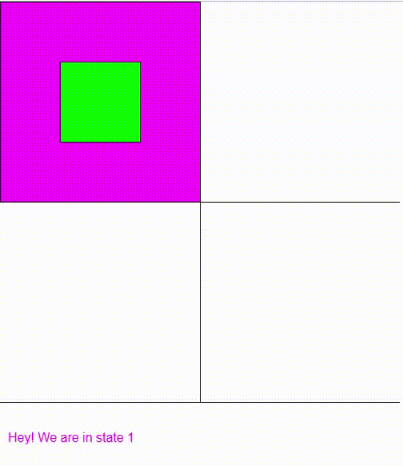
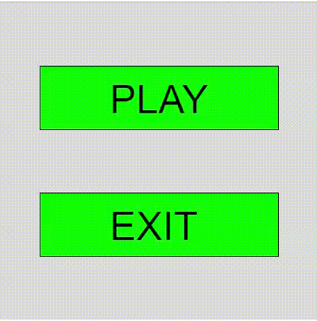

# Game States

See the Game States lesson video and example below.  Then do the following two homework questions:

<iframe src="https://drive.google.com/file/d/1xGH9cABGILzd5uG-IUGTJgpJGDOp2F-D/preview" width="640" height="480"></iframe>

```java

String gameState;

void setup() {
  size(400,400);

  gameState = "start screen";
}


void draw() {

  if (gameState == "start screen") {
    background(0,255,0);
    fill(0);
    text("Click the mouse to START!", 100,100);
  }
  else if (gameState == "red screen") {
    background(255,0,0);
  }
  else if (gameState == "blue screen") {
    background(0,0,255);
  }

}

void mouseClicked() {
  if (gameState == "start screen") {
    gameState = "red screen";
  }
  else if (gameState == "red screen") {
    gameState = "blue screen";
  }
}
```

# Homework
1. Create a program that functions like the image below.  It has 4 mouse over zones that change when the mouse is clicked.

[](https://drive.google.com/file/d/1dtVsKoiLSx90fQUom4hkpEnKRfa0jW_g/view?usp=sharing)
<br/>
2. Create a program that functions like the image below.
[](https://drive.google.com/file/d/1--X0y-HCitYeJe0Ms5gaim0mmF-Kbs0L/view?usp=sharing)
